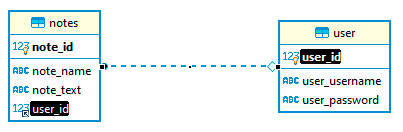

# Backend_Soap

Servidor/banco de dados criado para um projeto pessoal.
 
<h3> 

</h3>

# <h1> Requisitos <h1>
 
1. 📦<i> MySQL<i>
2. 📦<i> XAMPP<i>
3. 📦<i> NPM ou YARN<i>

# <h1> Rodar aplicação </h1>

 1. 🔥 npm install
 2. 🔥 npm dev

